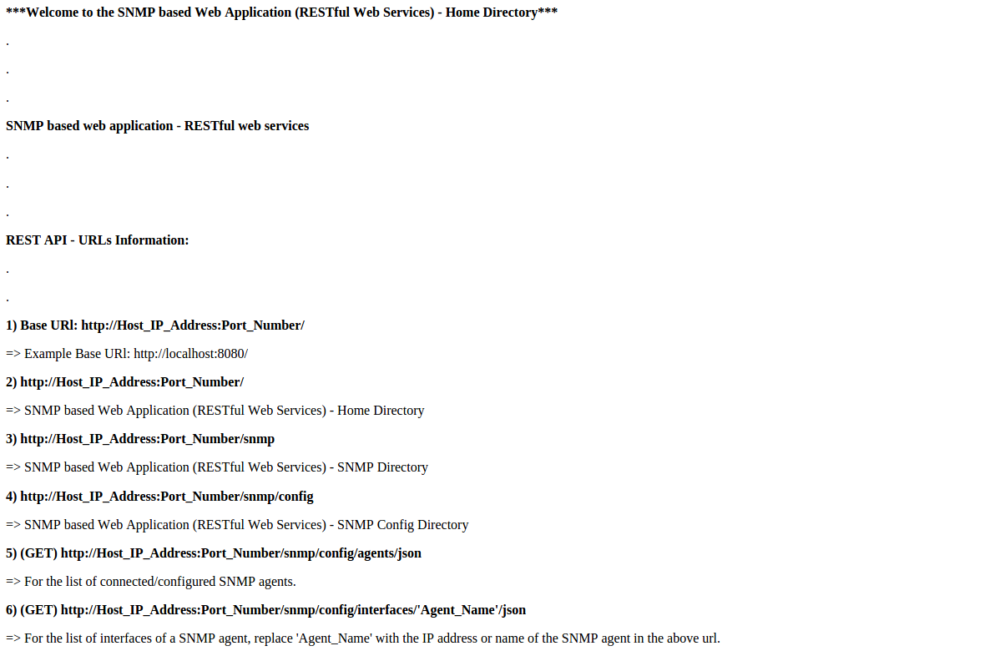
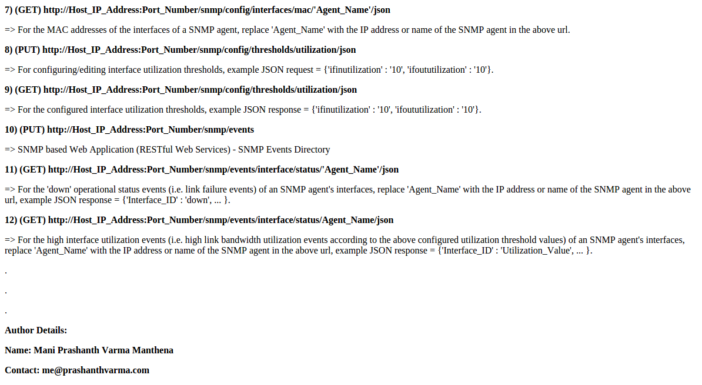

# SNMPWebApplication

SNMPWebApplication is a custom built SNMP-based network interface monitoring web application, it exposes network interface failure and high bandwidth utilization events with configurable utilization thresholds via its REST API to the applications running on top of it (e.g. NaaSPlatform). Moreover, it is a prerequisite for NaaSPlatform.

When using SNMPWebApplication along with NaaSPlatform please refer to the accompanying article: Mani Prashanth Varma Manthena, Niels L. M. van Adrichem, Casper van den Broek and Fernando A. Kuipers, An SDN-based Architecture for Network-as-a-Service, IEEE Conference on Network Softwarization (IEEE NetSoft), London, UK, April 13-17, 2015 http://www.nas.ewi.tudelft.nl/people/Fernando/papers/SDN4NaaS.pdf

SNMPWebApplication's source code is written and configured for network core interface monitoring of proof-of-concept (PoC) Testbed Setup A mentioned in the above article. However, if you want to use it for other testbed setups, you need to make some changes to the source code scripts and configuration files of SNMPWebApplication. Information regarding these required changes to the source code scripts and configuration files of SNMPWebApplication is mentioned in the section Custom Testbed Setups at the end of this document.

## Prerequisites

SNMPWebApplication is completely written in Python 2.7 due to its simplicity, interoperability, support and platform agnostic nature. Thus, SNMPWebApplication will run in all OS distributions and environments with Python version 2.x installed. 

SNMPWebApplication has been tested and implemented in systems with Debian-based Linux OS and Python version 2.7 installed.

### Python packages

SNMPWebApplication requires the following Python packages:

1. Bottle
2. PySNMP

You can install these packages using the following terminal commands:

`$ sudo apt-get install python-pip python-dev build-essential` 

`$ sudo pip install --upgrade pip` 

`$ sudo pip install --upgrade virtualenv`

`$ sudo pip install bottle pysnmp`

Additionally, you might want to install the Net-SNMP software suite in your system for performing SNMP-based operations from your terminal window for testing and management of underlying SNMP-enabled network devices:

You can install the Net-SNMP software suite using the following terminal command:

`$ sudo apt-get install snmp`

### Terminal emulator

SNMPWebApplication requires simultaneous execution of several python scripts in its source code. Thus, the system that hosts SNMPWebApplication mush have a terminal emulator like xterm installed. 

You can install the xterm terminal emulator using the following terminal command:

`$ sudo apt-get install xterm`

Note: If you want to use a terminal emulator other than xterm, you need to make corresponding changes to the start.sh script in the source code of SNMPWebApplication.

## Installing and configuring SNMPWebApplication

1. Download and un-zip (or) clone SNMPWebApplication source code to your system.

2. Configure the Ip address and port number  of SNMPWebApplication, this can be done by editing the last line of the `SNMP_Main_App` Python script in SNMPWebApplication's source code. 
    Last line of the `SNMP_Main_App` Python script:
 
    `run(host='localhost', port=8090, debug=True)` 
    
    In the above line, replace `localhost` with the IP address of the system hosting SNMPWebApplication. Furthermore, you can     also change the port number. Example configuration:

    `run(host='192.63.245.211', port=8090, debug=True)`

3. Check whether the SNMP protocol is configured properly in the underlying network devices. You can verify this by performing snmpwalk on all the underlying network devices in a new terminal window. As per the SNMP protocol configuration in the underlying network devices, make the necessary configurational changes (switch IP address and SNMP community) to the corresponding interface status and utilization monitoring python scripts in SNMPWebApplication's source code.

4. As per the testbed setup, edit the configuration files (agent names, device interfaces and interface MAC addresses) in the [Config](Config) folder of SNMPWebApplication's source code. These configuration files are in simple and readable JSON format. For this, you can gather network devices information by performing snmpwalk on all the underlying network devices in a new terminal window by using the corresponding SNMP OIDs. For more information on this refer Net-SNMP online documentation and tutorials.

## Launching SNMPWebApplication

After successfully configuring SNMPWebApplication, open a new terminal window and go to SNMPWebApplication's main directory, where you need to enter the following command to launch SNMPWebApplication.

`$ sudo ./start.sh`

Note: The `./start.sh` command launches all the required scripts in the source code of SNMPWebApplication simultaneously using the xterm terminal emulator.

## Verification

After launching SNMPWebApplication, verify its operational status by navigating to its web GUI.

URL:
http://snmp-ip:8090

Default URL:
[http://localhost:8090](http://localhost:8090)

Note: `snmp-ip` in the above URL is the IP address of the system hosting SNMPWebApplication, this URL is also the base URL for SNMPWebApplication's REST API. All the exposed REST APIs by SNMPWebApplication are well documented in its web GUI.

## SNMPWebApplication Web GUI

## Custom Testbed Setups

If you want to implement SNMPWebApplication for custom testbed setups, you need to make following changes to the source code scripts and configuration files of SNMPWebApplication:

1. As per your testbed setup, you need to replace the existing interface status and utilization monitoring python scripts. For this, just copy the contents of the existing scripts (e.g. `BA_Interface_Status_Monitoring_App` and `BA_Interface_Utilization_Monitoring_App`) while making the necessary configurational changes (script name, switch IP address and SNMP community name inside the script) to them and replace them in SNMPWebApplication's source code main directory.

2. As per your testbed setup, edit the configuration files (agent names, device interfaces and interface MAC addresses) in the [Config](Config) folder of SNMPWebApplication's source code. These configuration files are in simple and readable JSON format. For this, you can gather network devices information by performing snmpwalk on all the underlying network devices in the terminal window by using the corresponding SNMP OIDs. For more information on this refer Net-SNMP online documentation and tutorials.

3. Accordingly, edit the startup script (`start.sh`) to run the replaced and/or newly added network interface status and utilization monitoring scripts by including their respective names in it. 
